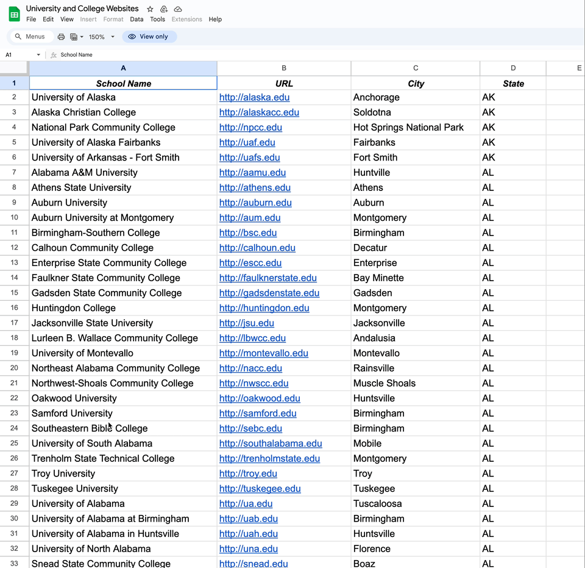

# alfred-gsheets
 

Inspired by `I-sheet-you-not`, this Workflow provides the means to create new Workflows to access individual Google Sheets.




## Usage
1. Open a Google Sheet in your browser. 
2. Launch `alfred-sheets` via keyword (default: `gshe`) or hotkey
3. `alfred-sheets` will check the frontmost page with one of three outcomes:
	1. The website is not a Google Sheet ▶️ check URL
	2. The website is a Google Sheet but you don't have the right permissions ▶️ review the `Setting up` section
	3. The website is a Google Sheet and you have at least viewing privileges ▶️ go to step 4
4. `alfred-sheets` will list the individual worksheets. Select one to generate an `alfred-sheets` Workflow instance to browse that Sheet. 
5. Once a new Workflow is created, ↩️ will bring you to its `Workflow Configuration`, where changes to keyword etc. can be made:
 - Header row (column headers). Set this to 0 if no header
 - columns for Tetle (required), subtitle and argument. 
 	- Alternatively, a custom layout can be set as follows: up to three lines (for Title, Subtitle, and Arg), with layout text in quotes and column numbers in square brackets. Example:

```
Title: "College 🎓: [1]"
Subtitle: "City: [2]"
Arg: "URL: [3]"

```

- *Note:* if a custom layout is used, the Title, Subtitle and Arg fields will be ignored. 
- `Append column`: If you have writing privileges, you can indicaate a column to which append values via `alfred-gsheets` using a keyword (default: `[main workflow keyword]::append`, e.g. `uni::append`) or hotkey
- entering the main keyword (default: first three letters of the workflow name) will list sheet columns according to the Title, Subtitle, and Arg variables, or custom layout. 
- If the argument is a URL, `Enter` ↩️ will open it in your browser


 

## Setting up ⚙️
*Note: this setup is more complex than the average workflow. I tried to document all the steps below, feel free to point to unclear steps or instructions. A screencast of the process is here.*

Steps 1-7 are needed to access public Google Sheets. An additional step 8 is needed to access private Google Sheets. 


### Setting up Google Sheets API credentials (required):

1. Log into your Google account
1. Go to the [Google Developers Console](https://console.developers.google.com/)
1. Using the `Select a project` dropdown menu, create a new project (or select an existing one).
1. Click on `+ ENABLE APIS AND SERVICES` at the top of the page, then select  `Google Sheets API` for your project. Click on `ENABLE`
1. From the API Console, click `Credentials` in the sidebar, then click on `+ CREATE CREDENTIALS` at the top of the page and select `Service account` to create a new service account key
1. enter an account name (e.g. "MyAlfredAPI") and a description (e.g. "for Alfred Workflow")
2. in `Manage service accounts`, select `Keys` and create a new JSON key, which will be downloaded onto your computer. This key contains your account credentials.
3. Move that file to your preferred location, then enter the path to the file in `Key File` in `Workflow configuration`. This is required for the workflow to work. 

### If the Google sheet is private
1. Copy the service account email address (go to `Manage service accounts`, hover over the email of your project, a copy icon will appear).
1. Share the private Google Sheet with the service account email address, granting it the appropriate access permissions.


# Thanks
- [tutorial](https://www.makeuseof.com/tag/read-write-google-sheets-python/) on how to access google sheets via Python 
- Icons from [Flaticon](www.flaticon.com) 
	- https://www.flaticon.com/free-icon/table-cell_6099818
	- https://www.flaticon.com/free-icon/add-button_8246338

